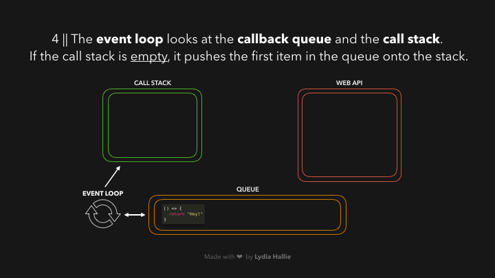

# Event Handling

## Introduction to Event-Driven Programming

Flow of the program is determined by events i.e user actions (mouse clicks)

### JavaScript Event Loop





[Read more](https://dev.to/lydiahallie/javascript-visualized-event-loop-3dif)

### Promises

Mechanism for handling asynchronous operations.

#### Promises States

1. Pending: Initial state, the promise is neither fulfilled nor rejected.
2. Fulfilled: The operation completed successfully, and the promise has a resulting value.
3. Rejected: The operation failed, and the promise has a reason for the failure.

### Async - Await Syntax

Modern way of handling asynchronous operations in JavaScript

The async keyword is used to declare an asynchronous function. An async function always returns a Promise implicitly, even if you don't explicitly return a Promise

```javascript
async function fetchData() {
  // Asynchronous operations
  return data
}
```

The await keyword is used inside an async function to pause the execution of the function until the Promise is resolved. It can only be used inside an async function.

```javascript
async function fetchData() {
  let response = await fetch('https://api.example.com/data')
  let data = await response.json()
  console.log(data)
}
```

Async/await allows you to handle errors in a more synchronous style using try...catch blocks.

```javascript
async function fetchData() {
  try {
    let response = await fetch('https://api.example.com/data')
    let data = await response.json()
    console.log(data)
  } catch (error) {
    console.error('Error:', error)
  }
}
```
